<h1 align="center">Galactic Wide Web</h1>

	
  
	
   
	
  
  
   
  

  Galactic Wide Web is a Discord bot for Helldivers 2 that provides real-time information on the Galactic War.
   
  It pulls live data from the official Helldivers 2 API and the Steam API, and keeps an auto-updating dashboard refreshed every 15 minutes with a strategic overview of the current war effort.  
  The bot includes slash commands, interactive buttons, dropdowns, and embedded content. All interactions take place in text channels.
   
  Server administrators (or those with Manage Server permissions) can configure which channels are used for dashboards and map posts.
   
  Notifications can be enabled for a range of events, including:
  

    <ul align="center">
    New Major Orders
     
    Personal Orders
     
    Dispatches
     
    Global Events
     
    DSS movements and Tactical Action changes
     
    Planetary Region changes
     
    Campaign wins and losses
     
    and Steam patch notes.
    </ul>
  

   
  The bot supports multilingual output, currently offering English, French, German, Italian, Portuguese (BR),
   
  Russian, Spanish, Chinese (Traditional), and Turkish, with more languages welcome via contributions.
    
  Built using Disnake, it stores settings in PostgreSQL and uses Pillow and opencv to generate maps.

## Quick Navigation
- [Inviting the Bot](#inviting-the-galactic-wide-web)
- [Examples](#examples)
- [Support](#support)
- [Contributing](#contributing)

## Inviting the Galactic Wide Web
Want to try out the GWW on your server or your account? [Invite Link](https://discord.com/oauth2/authorize?client_id=1212535586972369008)

## Examples
### `/check_missing_translations language_to_check: pt-br`
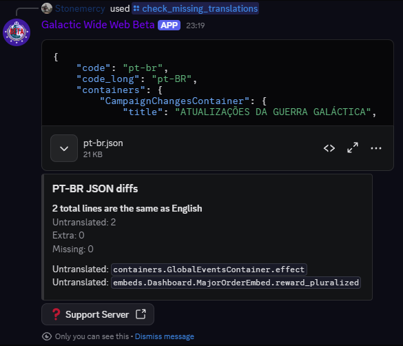

<a href="#top">Back to Top ↑</a>

### `/community_servers`
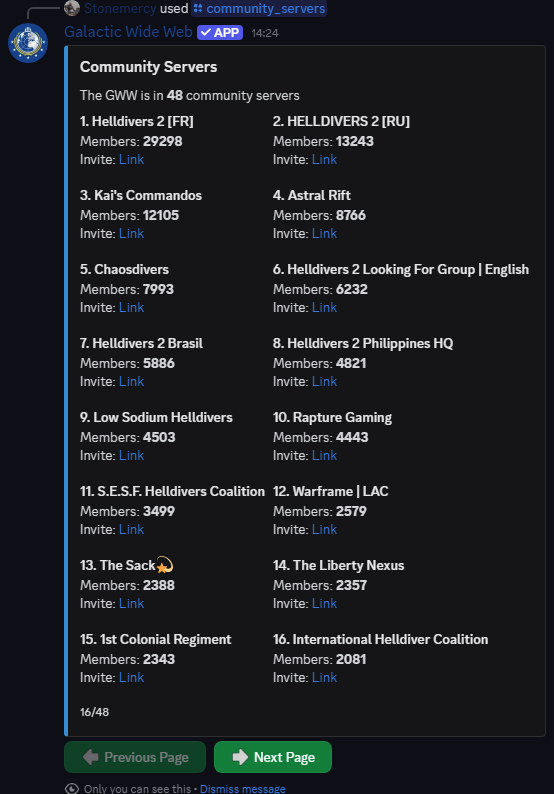

<a href="#top">Back to Top ↑</a>

### `/dispatches`
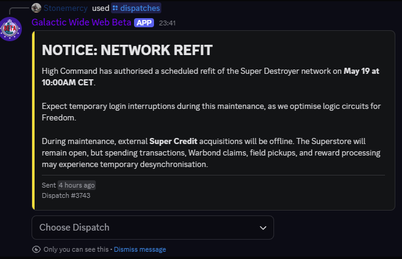

<a href="#top">Back to Top ↑</a>

### `/dss`

<a href="#top">Back to Top ↑</a>

### `/global_events`
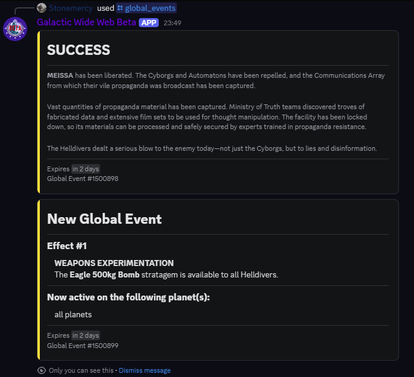

<a href="#top">Back to Top ↑</a>

### `/help command: check_missing_translations`
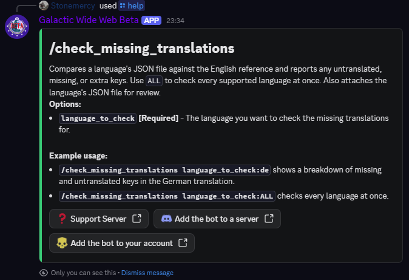

<a href="#top">Back to Top ↑</a>

### `/major_order`
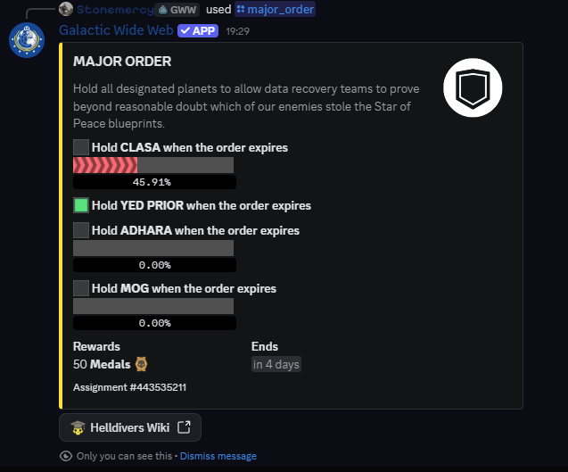

<a href="#top">Back to Top ↑</a>

### `/map`
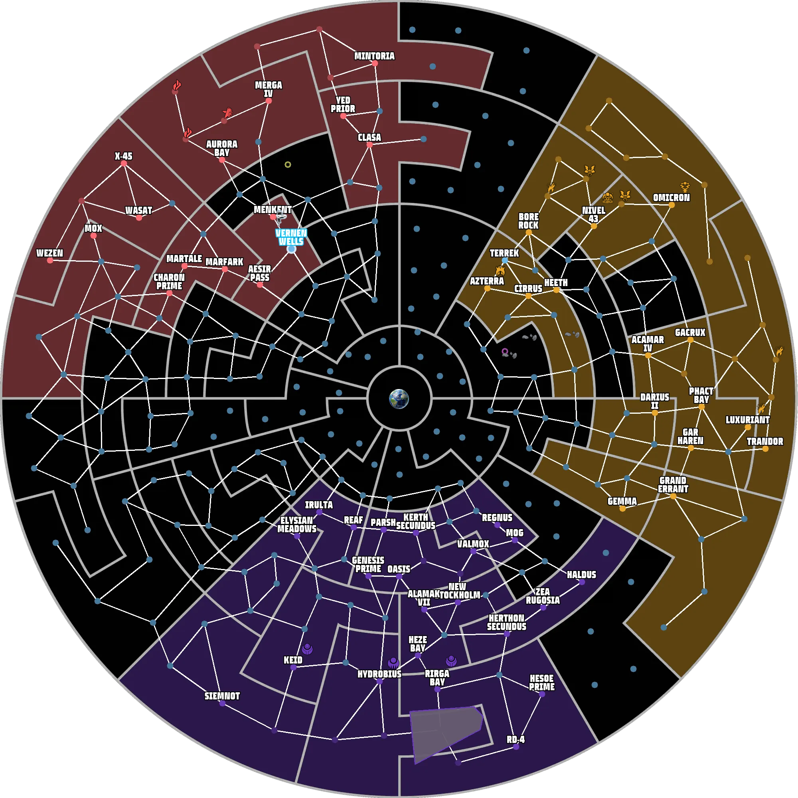

<a href="#top">Back to Top ↑</a>

### `/personal_order`

<a href="#top">Back to Top ↑</a>

### `/planet planet: 112-VERNEN WELLS`
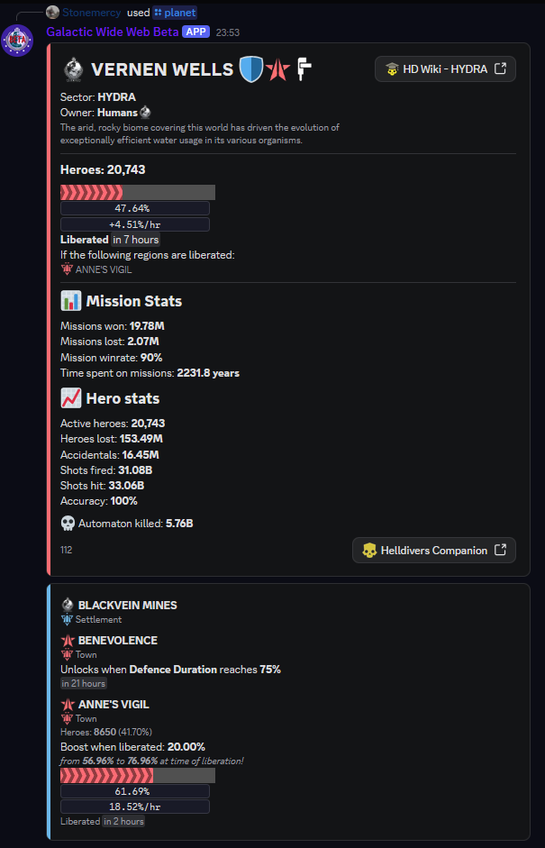

<a href="#top">Back to Top ↑</a>

### `/setup`
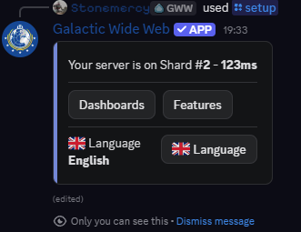

<a href="#top">Back to Top ↑</a>

### `/steam`
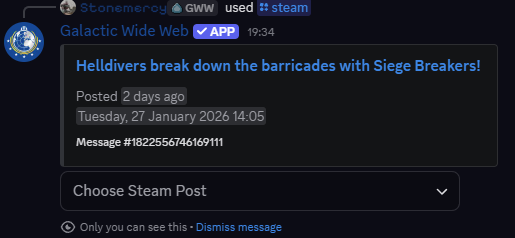

<a href="#top">Back to Top ↑</a>

### `/warfront faction: Terminids`
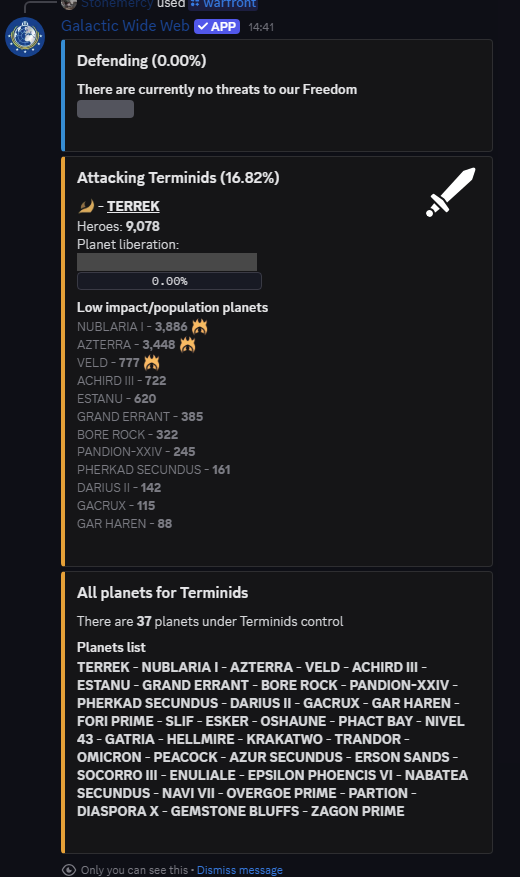

<a href="#top">Back to Top ↑</a>

## Support
Available here: [Discord Support Server](https://discord.gg/Z8Ae5H5DjZ)

<a href="#top">Back to Top ↑</a>

## Contributing
Contributions are welcome!

To contribute to localization:
1. Open an issue with the Language Request template
2. Create a pull request and add a .json file to the [data/languages/](https://github.com/Stonemercy/Galactic-Wide-Web/tree/main/data/languages) folder

or just head to the Discord Support Server above

<a href="#top">Back to Top ↑</a>

