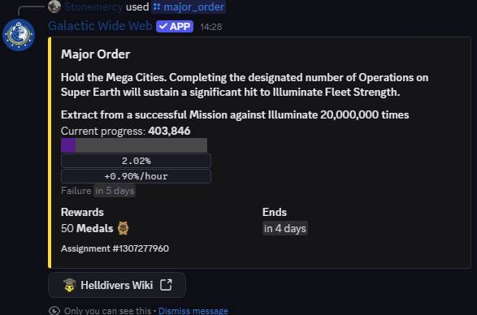
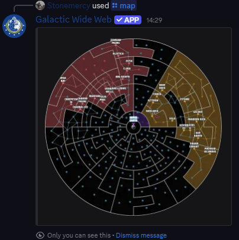
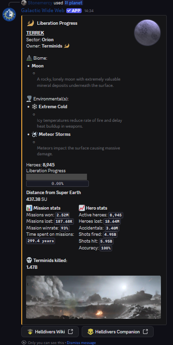
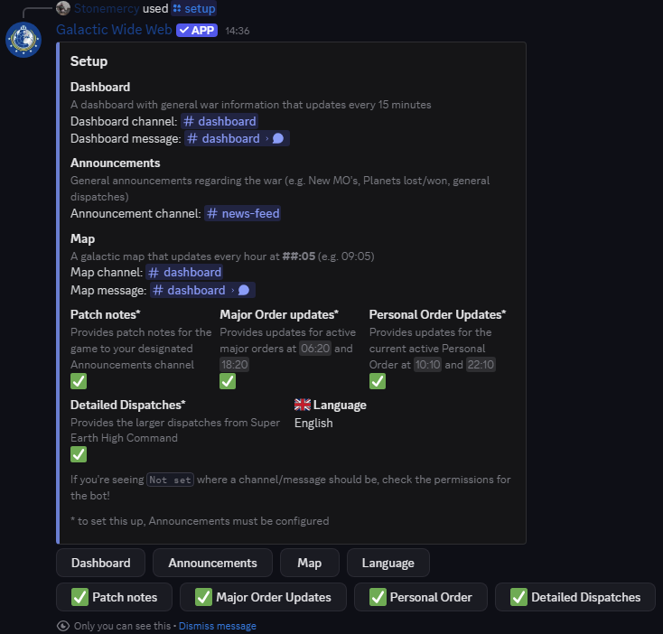
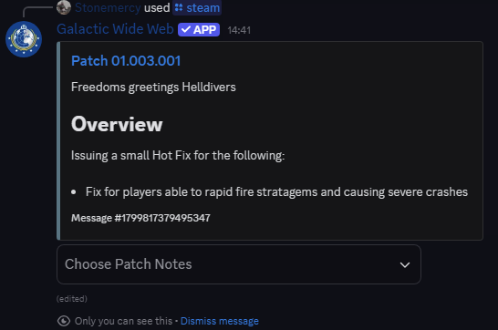

<h1 align="center">Galactic Wide Web</h1>

	
	
   
	
  
  
   
  

  Galactic Wide Web is a Discord bot focused on providing real-time information and interactive tools for Helldivers 2. It pulls live data from the official Helldivers 2 API and combines it with curated information from the open-source <a href alt="Helldivers 2 Json Repo" src="https://github.com/helldivers-2/json">helldivers-2/json</a> repository to give users up-to-date game insights. Its core feature is an updating dashboard that refreshes every 15 minutes, offering a strategic overview of the current state of the galactic war.

  The bot includes a robust in-Discord wiki with slash commands, interactive buttons, dropdowns, and embedded content to guide users through factions, enemies, warbonds, equipment, and more. All interactions take place in text channels.

  Highly configurable, Galactic Wide Web lets server administrators choose which channels are used for dashboards and announcements. Optional push notifications can be toggled for key updates like Major Orders (MOs), Steam patch notes, and detailed dispatches. The bot supports multilingual output, currently offering English, French, German, Italian, Portuguese (BR), Russian, and Spanish—with more languages welcome via contributions.

  Built using Disnake, it stores settings in PostgreSQL and uses Pillow to generate maps.

## Quick Navigation
- [Inviting the Bot](#inviting-the-galactic-wide-web)
- [Commands](#commands)
- [Examples](#examples)
- [Support](#support)
- [Contributing](#contributing)

## Inviting the Galactic Wide Web
Want to try out the GWW on your server? [Invite Link](https://discord.com/oauth2/authorize?client_id=1212535586972369008)

## Examples
`/check_missing_translations DE`

<a href="#top">Back to Top ↑</a>

`/community_servers`

<a href="#top">Back to Top ↑</a>

`/help check_missing_translations`

<a href="#top">Back to Top ↑</a>

`/major_order`

<a href="#top">Back to Top ↑</a>

`/map`

<a href="#top">Back to Top ↑</a>

`/planet Terrek`

<a href="#top">Back to Top ↑</a>

`/setup`

<a href="#top">Back to Top ↑</a>

`/siege_fleets THE GREAT HOST`

<a href="#top">Back to Top ↑</a>

`/steam`

<a href="#top">Back to Top ↑</a>

`/warfront Terminids`

<a href="#top">Back to Top ↑</a>

`/wiki`

<a href="#top">Back to Top ↑</a>

## Support
Available here: [Discord Support Server](https://discord.gg/Z8Ae5H5DjZ)

<a href="#top">Back to Top ↑</a>

## Contributing
Contributions are welcome!

To contribute to localization:
1. Open an issue with the Language Request template
2. Create a pull request and add a .json file with your language's code found [here](https://github.com/Stonemercy/Galactic-Wide-Web/blob/d28d96b81c43655ed7be0c07e118f4752ba11acf/data/lists.py#L521)

or just head to the Discord Support Server above

<a href="#top">Back to Top ↑</a>

